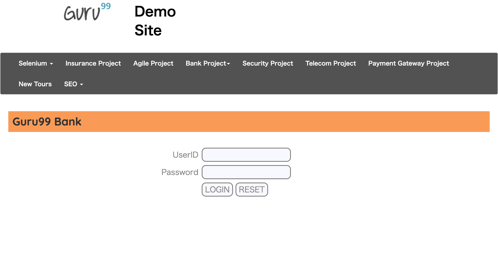

-   [materialstore tutorial](#materialstore-tutorial)
    -   [Links](#links)
        -   [Repository and product](#repository-and-product)
        -   [API documents](#api-documents)
    -   [1. How I developed the Materialstore library](#1-how-i-developed-the-materialstore-library)
        -   [Background](#background)
        -   [Problem to solve](#problem-to-solve)
    -   [2. The simplest usage of materialstore](#2-the-simplest-usage-of-materialstore)
        -   [2.1 Materializing screenshots](#2-1-materializing-screenshots)
        -   [2.2 Materializing HTML sources](#2-2-materializing-html-sources)
    -   [3. Comparing 2 environments of a web app --- Twins mode](#3-comparing-2-environments-of-a-web-app-twins-mode)
    -   [4. Comparing 2 time-slices of a web app --- Chronos mode](#4-comparing-2-time-slices-of-a-web-app-chronos-mode)
    -   [5. Inspecting many URLs in one run](#5-inspecting-many-urls-in-one-run)
    -   [6. Navigate through a web app](#6-navigate-through-a-web-app)

# materialstore tutorial

## Links

### Repository and product

-   [materialstore on GitHub](https://github.com/kazurayam/materialstore)

-   [Maven Central URL](https://mvnrepository.com/artifact/com.kazurayam/materialstore)

### API documents

-   [materialstore Javadoc](https://kazurayam.github.io/materialstore/api/)

-   [materialstore-mapper Javadoc](https://kazurayam.github.io/materialstore-mapper/api/)

## 1. How I developed the Materialstore library

### Background

Several years ago when I worked for an IT company, I endeavored to develop
automated UI tests for their Web applications.
I studied Selenum WebDriver in Java.
I studied the following article to learn how to take screenshots of web pages.

-   [Guru99, How to Take Screenshot in Selenium WebDriver](https://www.guru99.com/take-screenshot-selenium-webdriver.html)

I retyped the sample code. Here I will quote the source codes.

    package guru99.selenium.screenshot;

    import io.github.bonigarcia.wdm.WebDriverManager;
    import org.apache.commons.io.FileUtils;
    import org.junit.jupiter.api.AfterEach;
    import org.junit.jupiter.api.BeforeAll;
    import org.junit.jupiter.api.BeforeEach;
    import org.junit.jupiter.api.Test;
    import org.openqa.selenium.OutputType;
    import org.openqa.selenium.TakesScreenshot;
    import org.openqa.selenium.WebDriver;
    import org.openqa.selenium.chrome.ChromeDriver;

    import java.io.File;

    /**
     * Guru99, How to Take Screenshot in Selenium WebDriver
     * https://www.guru99.com/take-screenshot-selenium-webdriver.html
     */
    public class TakeScreenshotTest {

        @Test
        public void test_takeScreenshot() throws Exception {
            driver.get("http://demo.guru99.com/V4/");
            // Convert WebDriver object to TakeScreenshot
            TakesScreenshot scrShot = (TakesScreenshot)driver;
            // take a screenshot image
            File imageFile = scrShot.getScreenshotAs(OutputType.FILE);
            // copy the image into the specified destination
            File destFile = new File("./tmp/test.png");
            FileUtils.copyFile(imageFile, destFile);
        }

        @BeforeAll
        public static void beforeAll() {
            WebDriverManager.chromedriver().setup();
        }

        @BeforeEach
        public void beforeEach() {
            driver = new ChromeDriver();
        }

        @AfterEach
        public void afterEach() {
            if (driver != null) {
                driver.quit();
                driver = null;
            }
        }

        WebDriver driver;
    }

When I ran this, the test produced a PNG image file in the `tmp` directory
of the project:

    :~/github/materialstore-tutorial (master *+)
    $ tree ./tmp
    ./tmp
    └── test.png

    0 directories, 1 file

The `test.png` image looked as this:

The code worked just fine.

### Problem to solve

I repeated creating Selenium tests to take screenshots of many URLs.
During the course, I found a few problems in the short code shown above.

#### (1) Metadata of Web pages disappears out of the stored files

By executing the test, I got a file `./tmp/test.png`.
I knew that this file was created out of a web page at the URL `http://demo.guru99.com/V4/`.
But that **Metadata** (from which URL it was created, at which stage of test processing it was created, with what input data from human, etc) is not recorded in the stored file `./tmp/test.png`.
Other programs can not retrieve the metadata out of the stored PNG files.
Without the metadata, screenshots are not reusable for any other purposes.
The screenshots become bulky garbage as soon as created.

#### (2) I had to repeat writing code to create directories to store files

The Selenium library supports taking a screenshot into a temporary file.
But Selenium does not support organizing the created files.
I had to create a directory structure to store the PNG files in the test scripts repeatedly.

I tend to run a single test many times. If I want to reserve the outcomes of 1st, 2nd and 3rd …​
run, I need to create directories with name of timestamp format like
`20220414_093417`, `20220415_163924` and `20220416_170836`.
I repeated writing such code to create this directory structure, I got bored of it.
I realized I should not repeat this any longer.

#### (3) I had to repeat writing code to report the List of stored files

Once I got many PNG files on disk, naturally I wanted to have a concise view of them.
I wanted to create an HTML which renders the PNG files.
So I wrote a code to generate the HTML report.
I wanted reuse the code for other web applications.
I realised I should make the code as a reusable library.

#### (4) I wanted to compare 2 sets of screenshots

I took a set of screenshots of Development environment.
And I took a set of screenshot of Production environment.
I wanted to compare these 2 sets of visual images.
There could be visual differences between the two.
The differences would suggest something that I should look into.
Many of them would come from known difference between the two (application version could be different,
background database contains modified data, etc). But I may find something due to unknown reason.
That would point me to "bugs" to fix.

I can take 2 sets of screenshots of a single web application at 2 different timing: BEFORE upgrading and AFTER upgrading.
I want to take a list of visual differences between the two.
The list would help me ensuring that I have done nothing unexpected, which is called "fault".

## 2. The simplest usage of materialstore

### 2.1 Materializing screenshots

### 2.2 Materializing HTML sources

## 3. Comparing 2 environments of a web app --- Twins mode

## 4. Comparing 2 time-slices of a web app --- Chronos mode

## 5. Inspecting many URLs in one run

## 6. Navigate through a web app
