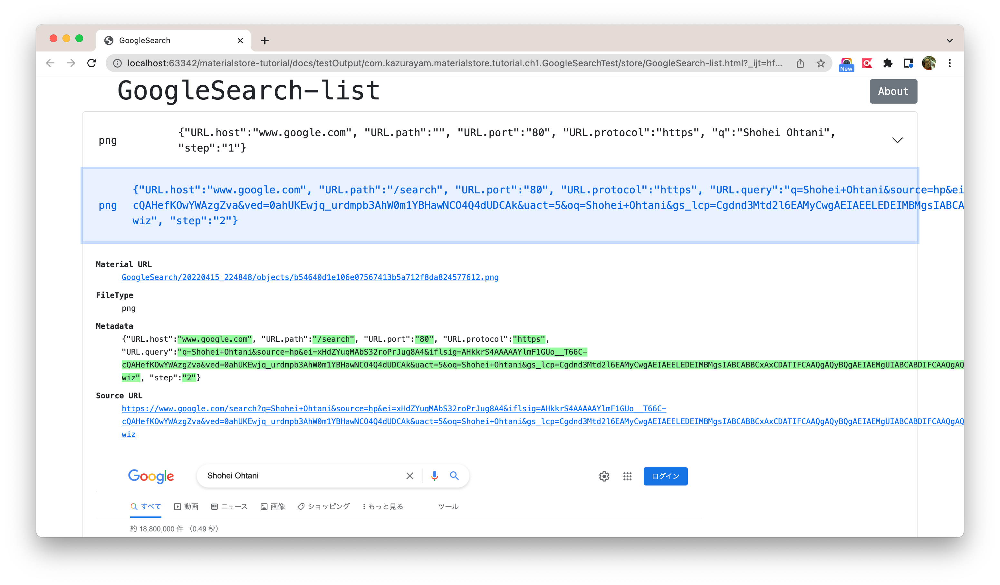

-   [materialstore tutorial](#materialstore-tutorial)
    -   [Links](#links)
        -   [Repository and product](#repository-and-product)
        -   [API documents](#api-documents)
    -   [Chapter1: Introduction](#chapter1-introduction)
        -   [Background](#background)
        -   [Problems to solve](#problems-to-solve)
            -   [Problem1: I shouldn’t repeat inventing directory structures](#problem1-i-shouldnt-repeat-inventing-directory-structures)
            -   [Problem2: Metadata of Web pages disappeared](#problem2-metadata-of-web-pages-disappeared)
            -   [Problem3: I shouldn’t repeat writing code for reporting](#problem3-i-shouldnt-repeat-writing-code-for-reporting)
            -   [Problem4: I want to perform Visual Inspection](#problem4-i-want-to-perform-visual-inspection)
    -   [Chapter2 "Materializing" screenshot and other resources](#chapter2-materializing-screenshot-and-other-resources)
        -   [Special term "Material"](#special-term-material)
        -   [External dependencies](#external-dependencies)
        -   [Sample 2-1: Materializing Google Search](#sample-2-1-materializing-google-search)
            -   [@BeforeAll](#beforeall)
            -   [@BeforeEach](#beforeeach)
            -   [@AfterEach](#aftereach)
            -   [@Test-annotated method](#test-annotated-method)
        -   [Directory structure of output](#directory-structure-of-output)
        -   [index file with Metadata](#index-file-with-metadata)
        -   [Report generated](#report-generated)
    -   [Chapter3 Processing a set of multiple URLs](#chapter3-processing-a-set-of-multiple-urls)
        -   [Custom implementation of the `MaterializingPageFunction` interface](#custom-implementation-of-the-materializingpagefunction-interface)

# materialstore tutorial

author: kazurayam, #1 April 2022

## Links

### Repository and product

-   [materialstore on GitHub](https://github.com/kazurayam/materialstore)

-   [Maven Central URL](https://mvnrepository.com/artifact/com.kazurayam/materialstore)

### API documents

-   [materialstore Javadoc](https://kazurayam.github.io/materialstore/api/)

-   [materialstore-mapper Javadoc](https://kazurayam.github.io/materialstore-mapper/api/)

## Chapter1: Introduction

### Background

Several years ago when I worked for an IT company, I endeavored to develop
automated UI tests for their Web applications.

I studied Selenium WebDriver in Java. I studied the following article to learn how to take screenshots of web pages.

-   [Guru99, How to Take Screenshot in Selenium WebDriver](https://www.guru99.com/take-screenshot-selenium-webdriver.html)

I retyped their sample code. Here I will quote the entire source codes.

    package guru99.selenium.screenshot;

    import io.github.bonigarcia.wdm.WebDriverManager;
    import org.apache.commons.io.FileUtils;
    import org.junit.jupiter.api.AfterEach;
    import org.junit.jupiter.api.BeforeAll;
    import org.junit.jupiter.api.BeforeEach;
    import org.junit.jupiter.api.Test;
    import org.openqa.selenium.OutputType;
    import org.openqa.selenium.TakesScreenshot;
    import org.openqa.selenium.WebDriver;
    import org.openqa.selenium.chrome.ChromeDriver;

    import java.io.File;

    /**
     * Guru99, How to Take Screenshot in Selenium WebDriver
     * https://www.guru99.com/take-screenshot-selenium-webdriver.html
     */
    public class TakeScreenshotTest {

        @Test
        public void test_takeScreenshot() throws Exception {
            // Chrome browser is opened by @BforeEach-annotated method

            // Navigate to the target URL
            driver.get("http://demo.guru99.com/V4/");

            // Convert WebDriver object to an instance of TakesScreenshot
            TakesScreenshot scrShot = (TakesScreenshot)driver;

            // take a screenshot in PNG format, which will be stored in a temporary file
            File imageFile = scrShot.getScreenshotAs(OutputType.FILE);

            // copy the image file into the specified destination
            File destFile = new File("./tmp/test.png");
            FileUtils.copyFile(imageFile, destFile);
        }

        @BeforeAll
        public static void beforeAll() {
            // we use https://bonigarcia.dev/webdrivermanager/ to control ChromeDriver
            WebDriverManager.chromedriver().setup();
        }

        @BeforeEach
        public void beforeEach() {
            // open Chrome browser
            driver = new ChromeDriver();
        }

        @AfterEach
        public void afterEach() {
            // close Chrome browser
            if (driver != null) {
                driver.quit();
                driver = null;
            }
        }

        WebDriver driver;
    }

When I ran this, the test produced a PNG image file in the `tmp` directory
under the project’s root directory:

    :~/github/materialstore-tutorial (master *+)
    $ tree ./tmp
    ./tmp
    └── test.png

    0 directories, 1 file

The `test.png` image looked as this:

The code worked just fine.

### Problems to solve

Based on the sample code above, I wrote many Selenium tests that take bunches of screenshots.
During the course, I found a few problems in the code shown above.

#### Problem1: I shouldn’t repeat inventing directory structures

The Selenium library supports taking a screenshot of browser’s viewport
and saving image into a temporary file.
However, Selenium does not provide a mean of organizing the created files.
I had to write codes that create a directory structure to store the PNG files.
Then, the [DRY](https://en.wikipedia.org/wiki/Don%27t_repeat_yourself)
principle came up to me.
I wanted to invent a reusable library that manages a directory tree to
store screenshots created by my Selenium tests.

#### Problem2: Metadata of Web pages disappeared

By executing the test, I got a file `./tmp/test.png`.
In fact the file was created out of a web page at the URL `http://demo.guru99.com/V4/`.
But the metadata is not recorded in the stored file.
When I say "metadata", I mean

-   from which URL the screenshot image was created: `./tmp/test.png` file
    was created out of the URL `http://demo.guru99.com/V4/`

-   which environment the page belonged: "Development" or "Production"

-   at which stage of an entire test run the image was created: step1, step2, step3, …​

and more.
Once the image file produced, later some program may read the `test.png` file
to reuse somehow, but the program will never be informed of the metadata.
With no metadata informed, screenshots are not reusable for any purposes.
`test.png` file becomes a garbage as soon as created.

#### Problem3: I shouldn’t repeat writing code for reporting

When I got many PNG files on disk,
I wanted an easy method to view images, of course.
I wrote a code to generate an HTML report of PNG files.
I realised I should make the code as a reusable library.

#### Problem4: I want to perform Visual Inspection

I would propose a special term **Visual Inspection**.
Visual Inspection is an exercise of taking 2 sets of page screenshots
and comparing them to find visual differences.
I would be able to compare Development environment vs Production environment.
I would be able to compare pages Before vs After updating a software in production.

Any differences found the pairs of screenshots will indicate
some differences in the software.
The differences would either be expected one or unexpected one.
In either case, the report of Visual Inspection will tell me exactly
which part of target web application I focus to.
I believe that Visual Inspection practice will help increase productivity of
web application developers and testers.

Not only the screenshot of web pages, I want to compare HTML sources,
CSS sources, JavaScript sources, as well.

Visual Inspection requires the problem 1, 2 and 3 to be resolved.

## Chapter2 "Materializing" screenshot and other resources

I will describe how the Materialstore library solves the problem1, 2 and 3.
I will describe the solution to the problem 4 later in another section.

### Special term "Material"

In this document I use a special term "**Material**".
A material is a file of which content is downloaded from a URL.
A screenshot of a web page is a typical material.
An HTML source text of a web page can be a material as well.
Any file downloaded from web can be a material.
Material files will have extensions of
`.png`, `.jpg`, `.html`, `.json`, `.xml`, `.txt`, `.csv`, `.js`, `.css`, `.xlsx`, `.pdf` and so on.

### External dependencies

This project requires several external jar files. See

-   <https://github.com/kazurayam/materialstore-tutorial/blob/master/build.gradle>

to find how to setup the environment.

### Sample 2-1: Materializing Google Search

The following code is a JUnit5-based test written in Java.
It performs the following processing:

1.  it `https://www.google.com`

2.  in the `<input type="text" name="q">` field, type a query string

3.  take a screenshot and save the PNG image into the `store` directory.

4.  and push SEND key; wait for the response

5.  once the Search Result page is shown, take another screenshot and save it into the `store` directory

6.  compile an HTML report that renders the 2 materials (screenshots in PNG).

7.  the report will show metadata of the materials, such as URL of web pages.

<!-- -->

    package com.kazurayam.materialstore.tutorial.ch2;

    import com.kazurayam.materialstore.Inspector;
    import com.kazurayam.materialstore.filesystem.FileType;
    import com.kazurayam.materialstore.filesystem.JobName;
    import com.kazurayam.materialstore.filesystem.JobTimestamp;
    import com.kazurayam.materialstore.filesystem.MaterialList;
    import com.kazurayam.materialstore.filesystem.Metadata;
    import com.kazurayam.materialstore.filesystem.QueryOnMetadata;
    import com.kazurayam.materialstore.filesystem.Store;
    import com.kazurayam.materialstore.filesystem.Stores;
    import io.github.bonigarcia.wdm.WebDriverManager;
    import org.junit.jupiter.api.AfterEach;
    import org.junit.jupiter.api.BeforeAll;
    import org.junit.jupiter.api.BeforeEach;
    import org.junit.jupiter.api.Test;
    import org.openqa.selenium.By;
    import org.openqa.selenium.Dimension;
    import org.openqa.selenium.Keys;
    import org.openqa.selenium.OutputType;
    import org.openqa.selenium.TakesScreenshot;
    import org.openqa.selenium.WebDriver;
    import org.openqa.selenium.WebElement;
    import org.openqa.selenium.chrome.ChromeDriver;
    import org.openqa.selenium.chrome.ChromeOptions;
    import org.openqa.selenium.support.ui.ExpectedConditions;
    import org.openqa.selenium.support.ui.WebDriverWait;

    import java.io.File;
    import java.net.URL;
    import java.nio.file.Files;
    import java.nio.file.Path;
    import java.nio.file.Paths;

    /**
     * A Selenium Test that does the following:
     * 1. open Chrome browser
     * 2. visit "https://www.google.com/"
     * 3. make a search for "Shohei Ohtani"
     * 4. take screenshots of the screen using AShot
     * 5. download HTML source of the web pages
     * 6. store the PNG and HTML files into the materialstore
     */
    public class InspectingGoogleSearch {

        private static Store store;
        private JobName jobName;
        private JobTimestamp jobTimestamp;
        private WebDriver driver;

        @BeforeAll
        public static void beforeAll() throws Exception {
            // we use WebDriverManager to control the version of ChromeDriver
            WebDriverManager.chromedriver().setup();

            // create a directory where this test will write output files
            Path projectDir = Paths.get(System.getProperty("user.dir"));
            Path outputDir = projectDir.resolve("build/tmp/testOutput")
                    .resolve(InspectingGoogleSearch.class.getName());
            Files.createDirectories(outputDir);

            // create a directory "store"
            Path root = outputDir.resolve("store");

            // prepare an instance of com.kazurayam.materialstore.filesystem.Store
            // which will control every writing/reading files within the store
            store = Stores.newInstance(root);
        }

        @BeforeEach
        public void beforeEach() {
            // open Chrome browser
            ChromeOptions opt = new ChromeOptions();
            opt.addArguments("headless");
            driver = new ChromeDriver(opt);
            // set the size of browser window
            Dimension dem = new Dimension(1024,768);
            driver.manage().window().setSize(dem);
        }

        @Test
        public void test_google_search_using_basic_materialstore_api() throws Exception {
            // specify names of sub-directories
            jobName = new JobName("test_google_search_using_basic_materialstore_api");
            jobTimestamp = JobTimestamp.now();

            // let Chrome navigate to the Google Search page
            URL searchPage = new URL("https://www.google.com");
            driver.navigate().to(searchPage);

            By by_input_q = By.cssSelector("input[name=\"q\"]");
            WebDriverWait wait = new WebDriverWait(driver, 10);
            wait.until(ExpectedConditions.visibilityOfElementLocated(by_input_q));

            // type a query string into the <input type="text" name="q"> field
            WebElement we_input_q = driver.findElement(by_input_q);
            String qValue = "Shohei Ohtani";
            we_input_q.sendKeys(qValue);

            // take screenshot of the Google Search page
            TakesScreenshot scrShot = (TakesScreenshot) driver;
            File tempFile1 = scrShot.getScreenshotAs(OutputType.FILE);

            // store the screenshot into the store
            Metadata metadata =
                    Metadata.builder(searchPage)
                            .put("step", "1")    // remember the step identification
                            .put("q", qValue)    // remember the query string typed
                            .build();
            store.write(jobName, jobTimestamp, FileType.PNG, metadata, tempFile1);

            // send ENTER to execute a search request;
            // then the browser will navigate to the Search Result page
            we_input_q.sendKeys(Keys.chord(Keys.ENTER));

            // wait for the Search Result page to load completely
            By by_img_logo = By.xpath("//div[contains(@class,'logo')]/a/img");
            wait.until(ExpectedConditions.visibilityOfElementLocated(by_img_logo));

            // take a screenshot of the Search Result page
            File tempFile2 = scrShot.getScreenshotAs(OutputType.FILE);

            // save the image into the store
            URL resultPageURL = new URL(driver.getCurrentUrl());
            Metadata metadata2 =
                    Metadata.builder(resultPageURL)
                            .put("step", "2")   // this is the 2nd step
                            .build();
            store.write(jobName, jobTimestamp, FileType.PNG, metadata2, tempFile2);

            // Now I want to compile a report in HTML.
            // get the list of all materials stored in the "store/<jobName>/<jobTimestamp>" directory
            MaterialList materialList = store.select(jobName, jobTimestamp, QueryOnMetadata.ANY);

            // compile an HTML report of the materials
            Inspector inspector = Inspector.newInstance(store);
            String fileName = jobName.toString() + "-list.html";
            Path report = inspector.report(materialList, fileName);
            System.out.println("The report will be found at " + report.toString());
        }

        @AfterEach
        public void afterEach() {
            if (driver != null) {
                driver.quit();
                driver = null;
            }
        }
    }

Let me add some explanation about this code.

#### @BeforeAll

The `@BeforeAll`-annotated static method `beforeAll()` is activated
by JUnit only once per execution.
`@BeforeAll` of the sample does the following stuff.

1.  Update the version of `ChromeDriver` class to the latest using `WebDriverManager`.

2.  create a directory named `store` where all output files are written into

3.  create an instance of `com.kazurayam.materialstore.filesystem.Store` interface
    to hold it as a variable named `store`.

#### @BeforeEach

The `@BeforeEach`-annotated method `beforeEach()` is activated by JUnit
before each of `@Test`-annotated method is invoked.
`@BeforeEach` of the sample does the following:

1.  open a Chrome browser in headless mode

2.  resize the browser’s window to 1024x768.

#### @AfterEach

The `@AfterEach`-annotated method `afterEach()` is activated by JUnit
after each of `@Test`-annotated method has finished.
`@AfterEach` of the sample does the following:

1.  close the Chrome browser

#### @Test-annotated method

`test_google_search_using_basic_materialstore_api()` method does the following:

1.  creates a JobName object with value same as the method name

2.  creates a JobTimestamp object with the current timestamp

3.  lets Chrome navigate to the URL of Google Search

4.  types a query string `Shohei Ohtani` into the `<input name="q"">` element

5.  takes a screenshot of the current page view using Selenium’s `TakesScreenshot` class;
    saven the PNG image into a Material.

6.  the material has a metadata based on the pages' URL,
    plus 2 additional attributes: `"step":"1"` and `"q":"Shohei Ohtani"`.

7.  send ENTER key; then browser navigates to the Search Result page which contains
    a list of links.

8.  takes one more screenshot of the current page view. saves the image into the store.

9.  the 2nd material has a metadata based on the Result page’s URL,
    plus additional attributes: `"step":"2"`

10. consequently we have got 2 PNG files created in the *&lt;JobName>/&lt;JobTimestamp>* directory.

11. get the list of material objects, pass it to the helper class
    to compile a HTML report.

The `@Test`-annotated method simulates an interation between human and web app,
so that the method is reasonably complex, requires fair amount of custom coding.

### Directory structure of output

When I ran the test, it creates a directory named `store` under the
project’s directory where a tree of directories/files are created.

    :~/github/materialstore-tutorial (master *+)
    $ tree ./build/tmp/testOutput
    ./build/tmp/testOutput
    └── com.kazurayam.materialstore.tutorial.ch2.InspectingGoogleSearch
        └── store
            ├── test_google_search_using_basic_materialstore_api
            │   └── 20220424_101150
            │       ├── index
            │       └── objects
            │           ├── 3eaf3dde146f0f4bc1d35282e12f769cb428754e.png
            │           └── 8f6a78e6ae7ce0eefa6ddb9d5f9a43a95b7e6099.png
            └── test_google_search_using_basic_materialstore_api-list.html

    5 directories, 4 files

The output directory tree has the following structure.

1.  Under a root directory, subdirectories and files are created. The directory is named as `store` as convention.

2.  Under the `store` directory there will be one or more *JobName* directories.
    You can give any name to the *JobName* directories, for example `test_google_search_using_basic_materialstore_api`.

3.  Under a *JobName* directory there will be one or more *JobTimestamp* directories.
    For example `20220424_101150`.
    Of course, this string represents "year+month+day hour+minute+second".
    Principally it will encode the timestamp when the directory was created.
    But the API allows you to manipulate the directory name
    as long as it follows the DateTimeFormat of `"uuuuMMdd_HHmmss"`.

4.  Under a *JobTimestamp* directory there is a directory with a fixed name `objects` .

5.  Under a `objects` directory there will be one or more *object* files.

6.  An *object* file is a physical file. The file name is in the format of
    40 Hex-decimal characters followed by a dot `.` appended with an extension.
    For example, `a7a5c13181ccadc1502bd325df2fa43d6a58a5be.png`.
    Materialstore API automatically decides the file name of objects
    based on the content byte array. So that the file name of objects will be unique
    with no duplication.

7.  The *object* files are stored flat in the `objects` directory.
    There is no sub-directory under the `objects` directory.

8.  Under a *JobTimestamp* directory there is a file with fixed name `index`.
    The `index` file is a plain text file so that you can browse it
    with a plain text editor. I will explain about the `index` file next.

The Materialstore library always uses this output directory structure,
which solves the **Problem1 (inventing directory structure)**.

### index file with Metadata

The `store/GoogleSearch/yyyyMMdd_hhmmss/index` file would be interesting.
Its content is something like this:

    8f6a78e6ae7ce0eefa6ddb9d5f9a43a95b7e6099 png {"URL.host":"www.google.com", "URL.path":"", "URL.port":"80", "URL.protocol":"https", "q":"Shohei Ohtani", "step":"1"}
    3eaf3dde146f0f4bc1d35282e12f769cb428754e    png {"URL.host":"www.google.com", "URL.path":"/search", "URL.port":"80", "URL.protocol":"https", "URL.query":"q=Shohei+Ohtani&source=hp&ei=16NkYrmOD9XUhwPr4oeIDA&iflsig=AHkkrS4AAAAAYmSx5_BtwDcqvk0AzR3gRL_yQcCCHhbk&ved=0ahUKEwj51Yyowqv3AhVV6mEKHWvxAcEQ4dUDCAk&uact=5&oq=Shohei+Ohtani&gs_lcp=Cgdnd3Mtd2l6EAMyCwgAEIAEELEDEIMBMgUIABCABDIFCAAQgAQyBQgAEIAEMgUIABCABDIFCAAQgAQyBQgAEIAEMgUIABCABFAAWD5gqwRoAHAAeACAAbABiAG1BJIBAzEuM5gBAKABAQ&sclient=gws-wiz", "step":"2"}

Points to note :

1.  The `index` file contains a sequence of text lines. Each line comprises with 3 parts:
    &lt;ID> \\t &lt;FileType> \\t &lt;Metadata>. The 3 parts are delimited by tabs.

2.  The `index` file
    is encoded with UTF-8.

3.  A single line in `index` file corresponds to a single physical file
    in the `objects` subdirectory.

4.  The name of physical files in the `objects` subdirectory has a standard format,
    that is 40 characters of hex-decimal string followed by a dot "." and ends with a FileType extension.

5.  The 40 characters (`<ID>` for short) are the SHA1 digital signature
    derived from the content byte array of each file.

6.  The Materialstore api automatically calculate the ID value.
    You, a programmer or a tester, are no longer responsible for naming each physical files.

7.  You are supposed to assign an appropriate `<FileType>` to a material you write
    into the store. See the javadoc of
    [FileType](https://kazurayam.github.io/materialstore/api/com/kazurayam/materialstore/filesystem/FileType.html)
    for the full list of supported FileTypes.
    The assigned FileType decides the file name extension ('.png' for example).
    It is necessary to assign appropriate file name extension to tell OS
    which application to invoke when you double-click the file to open.
    The Materialstore library let you assign any FileType to a material.
    The Materialstore library does not check if the FileType is appropriate to the actual content of the file.

8.  Each line in `index` file contains the `<Metadata>` part.
    For example, the URL out of which screenshots are taken, and the fact that I made a query for "Shohei Ohtani" to Google.

9.  What type of data can I put in the `<Metadata>` ? --- quite flexible.
    You can put any pair of Strings. The API supports a shortcut method to
    add a URL into Metadata because URL is most frequently used as Metadata.

10. The combination of `<FileType>` and `<Metadata>` of each line in `index`
    **MUST be unique** in a `index` file.
    An attempt to write an object into the store with
    duplicating `<FileType> + <Metadata>` with already stored object will be fail.
    You (programmer, tester) are supposed to assign a descriptive enough
    Metadata to each object.

11. The `com.kazurayam.materialstore.filesystem.Store` interface declares
    `write` methods to store files into the store,
    and `select` methods to retrieve materials out of the store.
    See the javadoc of
    [Store](https://kazurayam.github.io/materialstore/api/com/kazurayam/materialstore/filesystem/Store.html) class.

12. A Material object contains all the Metadata you wrote into it.
    Any program can call `store.select()` to get a Material instance with
    full Metadata carried over. It can utilize the file (screenshot png, etc)
    with Metadata associated.

The **Problem2 (Metadata)** is resolved by the `index` file and associated
Materialstore API.

### Report generated

The test generates an HTML like this:

-   [testOutput/com.kazurayam.materialstore.tutorial.ch2.InspectingGoogleSearch/store/test\_google\_search\_using\_basic\_materialstore\_api-list.html](testOutput/com.kazurayam.materialstore.tutorial.ch2.InspectingGoogleSearch/store/test_google_search_using_basic_materialstore_api-list.html)

As you see, the **problem3 (inventing report)** is resolved by the `Inspector`.

## Chapter3 Processing a set of multiple URLs

Imagine a case where I have multiple sets of URLs to inspect,
and each set contains multiple URLs.
It makes sense to make CSV files where I list target URLs.
For example, see the following examples:

**47news.csv**

    https://www.47news.jp/
    https://www.47news.jp/localnews
    https://www.47news.jp/economics
    https://www.47news.jp/sports
    https://www.47news.jp/culture

**GithubRepos.csv**

    https://github.com/microsoft/vscode
    https://github.com/tensorflow/tensorflow
    https://github.com/facebook/react-native
    https://github.com/rust-lang/rust

**weather.csv**

    https://www.theweathernetwork.com/us/weather/california/san-diego
    https://www.accuweather.com/en/vn/ho-chi-minh-city/353981/weather-forecast/353981
    https://www.timeanddate.com/weather/poland/warsaw
    https://www.weather-forecast.com/maps/Brazil

**www.police.pref.kanagawa.jp.csv**

    https://www.police.pref.kanagawa.jp/index.htm,div#footer
    https://www.police.pref.kanagawa.jp/index1.htm,div#footer
    https://www.police.pref.kanagawa.jp/index2.htm,div#footer
    https://www.police.pref.kanagawa.jp/eng/eng_idx.htm,div#footer
    https://www.police.pref.kanagawa.jp/eng/eng_guide.htm,div#footer
    https://www.police.pref.kanagawa.jp/eng/eng_map.htm,div#footer

There is no reason why these URLs are listed here.
Just they are example accessible on the Internet.

Now I want to write a JUnit5 test to process these 4 CSV files.

If you look back the source of
[InspectingGoogleSearch.java](https://github.com/kazurayam/materialstore-tutorial/blob/master/src/test/java/com/kazurayam/materialstore/tutorial/ch2/InspectingGoogleSearch.java),
you will find it fairly long. It calls `store.write(jobName, jobTimestamp, file)` and other fairly-low-level
API of the Materialstore library.
Now I want to process 4 CSV files.
Let me assume that I am going to write 5 JUnit test classes.
Then I want to make the test codes more concise with minimum repetition.

I will show you one more sample code. The following code employs
[Java8 Functional Interfaces](https://www.baeldung.com/java-8-functional-interfaces).
The Java8 Functional Interfaces enforces my code well-organized.

### Custom implementation of the `MaterializingPageFunction` interface

See the full source of `com.kazurayam.materialstore.tutorial.ch3.InspectingMultipleURLs1` class:

The import statements, `@BeforeAll`-annotated method, `@BeforeEach`-annotated method and
`@AfterEach`-annotated methods --- those are similiar to the

    package com.kazurayam.materialstore.tutorial.ch3;

    import com.kazurayam.materialstore.Inspector;
    import com.kazurayam.materialstore.filesystem.FileType;
    import com.kazurayam.materialstore.filesystem.JobName;
    import com.kazurayam.materialstore.filesystem.JobTimestamp;
    import com.kazurayam.materialstore.filesystem.Material;
    import com.kazurayam.materialstore.filesystem.MaterialList;
    import com.kazurayam.materialstore.filesystem.Metadata;
    import com.kazurayam.materialstore.filesystem.QueryOnMetadata;
    import com.kazurayam.materialstore.filesystem.Store;
    import com.kazurayam.materialstore.filesystem.Stores;

    import com.kazurayam.materialstore.materialize.MaterializingPageFunction;
    import com.kazurayam.materialstore.materialize.StorageDirectory;
    import com.kazurayam.materialstore.materialize.Target;
    import com.kazurayam.materialstore.materialize.TargetCSVReader;
    import io.github.bonigarcia.wdm.WebDriverManager;
    import org.apache.commons.io.FileUtils;
    import org.junit.jupiter.api.AfterEach;
    import org.junit.jupiter.api.BeforeAll;
    import org.junit.jupiter.api.BeforeEach;
    import org.junit.jupiter.api.Test;
    import org.openqa.selenium.Dimension;
    import org.openqa.selenium.OutputType;
    import org.openqa.selenium.TakesScreenshot;
    import org.openqa.selenium.WebDriver;
    import org.openqa.selenium.WebElement;
    import org.openqa.selenium.chrome.ChromeDriver;
    import org.openqa.selenium.chrome.ChromeOptions;
    import org.openqa.selenium.support.ui.ExpectedConditions;
    import org.openqa.selenium.support.ui.WebDriverWait;

    import java.io.File;
    import java.nio.file.Files;
    import java.nio.file.Path;
    import java.nio.file.Paths;
    import java.util.List;

    public class InspectingMultipleURLs1 {

        private static Store store;
        private JobName jobName;
        private JobTimestamp jobTimestamp;
        private WebDriver driver;
        private static Path targetCSV;

        @BeforeAll
        public static void beforeAll() throws Exception {
            // we use WebDriverManager to control the version of ChromeDriver
            WebDriverManager.chromedriver().setup();

            // create a directory where this test will write output files
            Path projectDir = Paths.get(System.getProperty("user.dir"));
            Path outputDir = projectDir.resolve("build/tmp/testOutput")
                    .resolve(InspectingMultipleURLs1.class.getName());
            if (Files.exists(outputDir)) {
                FileUtils.deleteDirectory(outputDir.toFile());
            }
            Files.createDirectories(outputDir);

            // create a directory "store"
            Path root = outputDir.resolve("store");

            // prepare an instance of com.kazurayam.materialstore.filesystem.Store
            // which will control every writing/reading files within the store
            store = Stores.newInstance(root);

            // find the file which contains a list of target URL
            targetCSV =
                    projectDir.resolve("src/test/resources/fixture")
                            .resolve("weather.csv");
            assert Files.exists(targetCSV);
        }

        @BeforeEach
        public void beforeEach() {
            // open Chrome browser
            ChromeOptions opt = new ChromeOptions();
            opt.addArguments("headless");
            driver = new ChromeDriver(opt);
            // set the size of browser window
            Dimension dem = new Dimension(1024,768);
            driver.manage().window().setSize(dem);
        }

        @Test
        public void test_multiple_URLs_using_Functional_Interface() throws Exception {
            // specify names of sub-directories
            jobName = new JobName("test_multiple_URLs_using_Functional_Interface");
            jobTimestamp = JobTimestamp.now();
            StorageDirectory storageDirectory = new StorageDirectory(store, jobName, jobTimestamp);

            // create a function to process the target
            MaterializingPageFunction<Target, WebDriver, StorageDirectory, Material> capture =
                    (target, driver, sd) -> {
                        // make sure the page is loaded completely
                        WebDriverWait wait = new WebDriverWait(driver, 20);
                        WebElement handle =
                                wait.until(ExpectedConditions.visibilityOfElementLocated(
                                        target.getBy()));
                        assert handle != null;
                        // take the screenshot of the page using Selenium
                        TakesScreenshot shooter = ((TakesScreenshot)driver);
                        File tempFile = shooter.getScreenshotAs(OutputType.FILE);
                        // copy the image into the store
                        Metadata metadata = Metadata.builder(target.getUrl()).build();
                        return store.write(jobName, jobTimestamp, FileType.PNG, metadata, tempFile);
                    };

            // materialize the target URLs
            List<Target> targetList = TargetCSVReader.parse(targetCSV);
            int x = 1;
            for (Target t : targetList) {
                Target target = t.copyWith("seq", Integer.toString(x++));
                driver.navigate().to(target.getUrl());
                // call the function defined above
                capture.accept(target, driver, storageDirectory);
            }

            // compile the HTML report
            MaterialList materialList = store.select(jobName, jobTimestamp, QueryOnMetadata.ANY);
            // compile an HTML report of the materials
            Inspector inspector = Inspector.newInstance(store);
            String fileName = jobName.toString() + "-list.html";
            Path report = inspector.report(materialList, fileName);
            System.out.println("The report will be found at " + report.toString());
        }

        @AfterEach
        public void afterEach() {
            if (driver != null) {
                driver.quit();
                driver = null;
            }
        }
    }
